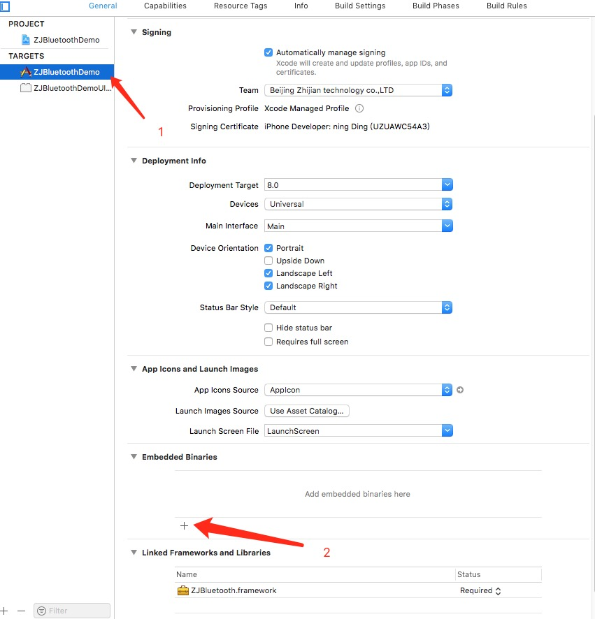

# iOS SDK 集成指南

## 配置工程

### 导入 SDK

## 配置工程
### 导入 SDK

#### 手动导入
* 在Github[官网下载最新SDK](https://github.com/ZhiJianDeveloper/iOS_BLE_SDK)
* 将 SDK 包解压，将ZJBluetooth.framework 拖入到你的工程目录中。如下图

* 图1

* 图2
* 

* 点击TARGETS 选择项目名 在Embedded Binaries 点击加号,如图所示

图3

* 弹出选项框后选择 ZJBluetooth.framework 后 点击 Add
* 图4
* 图5


### 使用SDK
#### 由于蓝牙特殊性,请使用真机运行Demo示例程序
* 真机运行
* 真机运行
* 真机运行
* 真机运行

####配置印章WiFi

```
    //	初始化SDKAES加密秘钥秘钥 可在 AppDelegate内初始化
	[ZJBluetoothManager initWithDefaultAESKey:@"1234567890123456" ivKey:@"1234567890123456"];
    //配置WiFi
	[[ZJBluetoothManager sharedManager] requestConfigNetworkByWiFiSSID:@"WIFISSID" password:@"PASSWORD" mac:@"12:12:23:23:35" completeBlock:^(NSInteger errorCode) {
        if (errorCode) {
            NSLog(@"%zd",errorCode);
        }
        else
        {
            NSLog(@"根据需要处理业务逻辑");
        }
    }];
    
```


## 常见错误
### Reason: image not found 请参照图3 图4 图5 添加framwork


###  无法获取WiFi账号 Xcode10请设置以下选项 如图


### 错误代码

code  | 描述
------------- | -------------
0|成功
1|当前印章未处于使用印章状态
2|缺少相关参数
3|配网失败
12|印章正在维护或者使用,请稍候重试
13|事件存储已满
871001|SDK AES秘钥未被初始化 或 秘钥长度不合法
871003|缺少相应请求参数
871004|mac地址为空
871005|wifi密码过长
871006|蓝牙搜索指定mac地址的印章超时
871007|使用次数小于1或者大于20000次
871008|印章名称过长或不合法
871009|未开启蓝牙
871010|事件ID不能为空,最大长度16 仅支持中文英文数字
871002|日期参数格式错误

                
